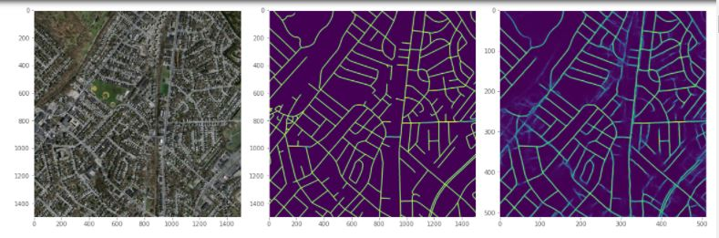
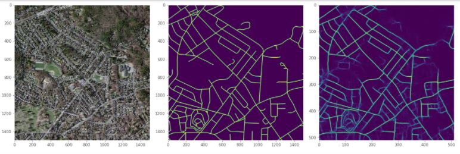
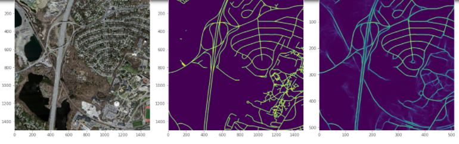

# massachusetts-roads-image-segmentation

1.Downloading data from Kaggle

for downloading data from Kaggle either we can download it from the website or use kaggle.json to connect to Kaggle. once connected we can download the zip file
2.unzipping the data

once we have the zip files we have to extract our data so that we can use it further
3.Checking some sample images

after extraction, we will take a random sample to check the images by visualizing them 

4.iterate over the data (as Numpy arrays)

now we have got the images we will iterate through them and do the pre-processing steps

5.Data Preprocessing - 
we will be changing image to array then we will be resizing them all to the same size
for that we will be using tf dataset

6.Data Augmentation and Train_Test split

once we were done with the pre-processing we will do train test split and do data augmentation using generate function which we have created 

7.Using UNet for image segmentation with dice loss as loss and metrics as IOU

we will use UNET to segment the image and extract its feature. 
we will be using dice loss,IOU,precision and accuracy

8.while model training use callbacks for checkpointing and early stopping

we will train our model and then plot the losses and learning curve.
we could train for more epochs based upon time and GPU confirmation 

9.Evaluation 
we will perform the evaluation on the validation images provided to us 

10.Visualize results on the validation image 

